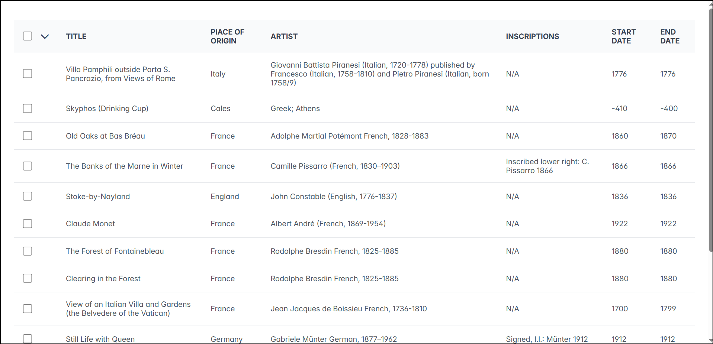
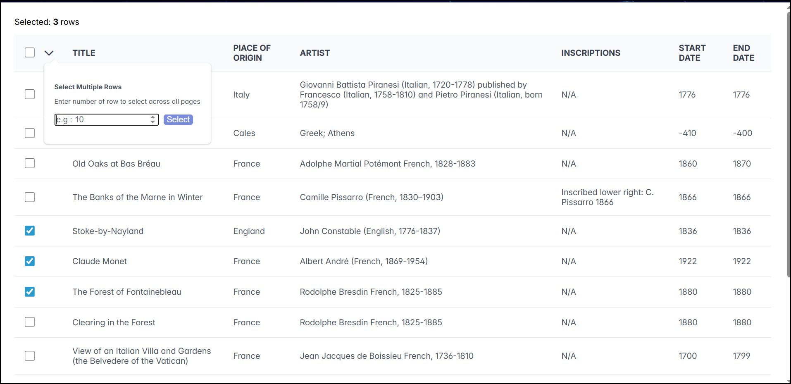

# 🎨 Artworks Data Table – React + TypeScript

## 📸 Screenshot

---

A server-side paginated data table built using **React (Vite) + TypeScript + PrimeReact**, displaying artwork data from the Art Institute of Chicago API.

This project demonstrates:

- Server-side pagination
- Persistent row selection across pages
- Custom row selection overlay
- Memory-efficient selection using IDs only
- No data prefetching
- Clean TypeScript architecture

---

## 🚀 Live Demo

👉 Deployed URL: (Add your Netlify link here)

---
